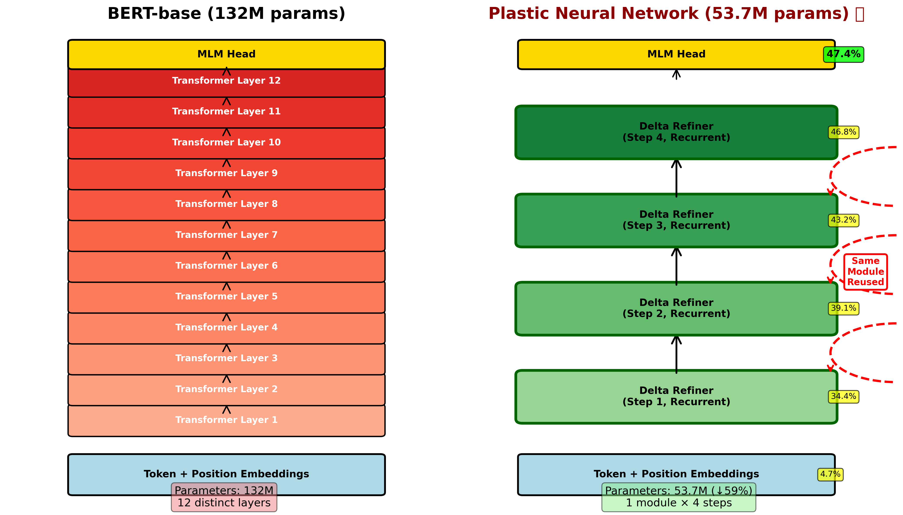
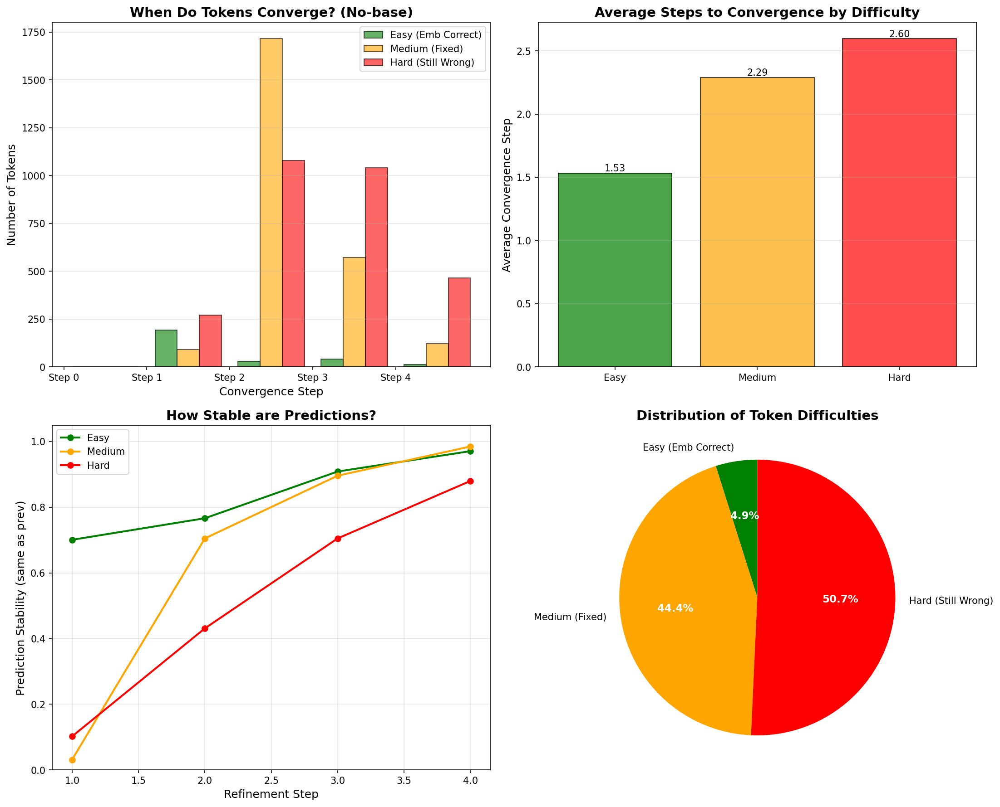

# Plastic Neural Networks: Learning Through Iterative Delta Refinement

[](https://doi.org/10.5281/zenodo.17548176)
[](https://opensource.org/licenses/MIT)
[](https://www.python.org/downloads/)
[](https://pytorch.org/)

> Achieving 88% of BERT's performance with 41% of the parameters through recurrent delta refinement

[Paper](https://doi.org/10.5281/zenodo.17548176) | [Twitter Thread](https://twitter.com/madst0614)

---

## 🎯 Overview

**Plastic Neural Networks (PNN)** explores an alternative to stacking transformer layers: what if we use one module recurrently instead?

Instead of 12 separate layers → **1 module applied 4 times**

**Key Results on WikiText-103 MLM:**
- **53.7M parameters** (vs BERT's 132M)
- **47.4% accuracy** (vs BERT's 57.0%)
- **88% of BERT's performance** with **41% of parameters**
- **2× parameter efficiency**

**Emergent Properties:**
- Natural curriculum learning (easy tokens: 1.53 steps, hard: 2.60 steps)
- Adaptive dimension selection (77% → 53% → 67% active across steps)
- Learned optimization behavior

---

## 📊 Quick Results

| Model | Parameters | Accuracy | Relative Perf. | Efficiency |
|-------|------------|----------|----------------|------------|
| BERT-base | 132M | 57.0% | 100% | 0.43%/M |
| **PNN** | **53.7M** | **47.4%** | **88%** | **0.88%/M** |




---

## 🏗️ Architecture

```python
# Simple conceptual overview
h^(0) = Embeddings(input)              # 4.7% accuracy

for step in range(4):
    delta = DeltaRefiner(h)             # Compute change
    gate = QueryKeyGate(h, delta)       # Decide what to update
    h = h + gate * delta                # Apply gated refinement

output = MLM_Head(h)                    # 47.4% accuracy
```

**Key Components:**
1. **Delta Refinement Module**: Single module applied recurrently
2. **Query-Key Gating**: Adaptive dimension-wise control
3. **Zero Initialization**: Stable training from embeddings

See [Architecture Details](#architecture-details) for more.

---

## 🚀 Quick Start

### Installation

```bash
# Clone the repository
git clone https://github.com/madst0614/plastic-neural-networks.git
cd plastic-neural-networks

# Create virtual environment
python -m venv venv
source venv/bin/activate  # On Windows: venv\Scripts\activate

# Install dependencies
pip install -r requirements.txt
```

### Training PNN

```bash
# Train on WikiText-103 (default settings from paper)
python train.py \
    --model pnn \
    --dataset wikitext-103 \
    --batch_size 384 \
    --epochs 15

# Or use config file
python train.py --config configs/pnn_wikitext103.yaml
```

### Training BERT Baseline

```bash
# For comparison
python train.py \
    --model bert \
    --dataset wikitext-103 \
    --batch_size 384 \
    --epochs 15
```

### Evaluation

```bash
# Evaluate trained model
python evaluate.py \
    --checkpoint checkpoints/best_model.pt \
    --dataset wikitext-103

# Analyze convergence patterns
python analyze_convergence.py \
    --checkpoint checkpoints/best_model.pt
```

---

## 📁 Repository Structure

```
plastic-neural-networks/
├── README.md                   # This file
├── requirements.txt            # Dependencies
├── setup.py                    # Package setup
├── LICENSE                     # MIT License
│
├── pnn/                        # Main package
│   ├── __init__.py
│   ├── models/
│   │   ├── __init__.py
│   │   ├── pnn.py             # PNN model
│   │   ├── bert_baseline.py   # BERT baseline
│   │   ├── delta_refiner.py   # Delta refinement module
│   │   └── gating.py          # Query-key gating
│   ├── data/
│   │   ├── __init__.py
│   │   ├── dataset.py         # Dataset wrapper
│   │   └── mlm_collator.py    # MLM data collator
│   └── utils/
│       ├── __init__.py
│       ├── training.py        # Training utilities
│       ├── evaluation.py      # Evaluation utilities
│       └── visualization.py   # Plotting utilities
│
├── scripts/                    # Training & evaluation scripts
│   ├── train.py               # Main training script
│   ├── evaluate.py            # Evaluation script
│   ├── analyze_convergence.py # Convergence analysis
│   └── analyze_gates.py       # Gate activation analysis
│
├── configs/                    # Configuration files
│   ├── pnn_wikitext103.yaml   # PNN config
│   └── bert_baseline.yaml     # BERT baseline config
│
├── notebooks/                  # Jupyter notebooks
│   ├── 01_explore_data.ipynb
│   ├── 02_visualize_results.ipynb
│   └── 03_analyze_gates.ipynb
│
├── tests/                      # Unit tests
│   ├── test_models.py
│   ├── test_gating.py
│   └── test_training.py
│
├── assets/                     # Images for README
│   ├── architecture_comparison.png
│   ├── convergence_no_base.png
│   └── gate_activation_no_base.png
│
└── paper/                      # Paper and supplementary
    ├── PNN_paper.pdf
    └── supplementary/
```

---

## 🔬 Reproducing Paper Results

### Full Training Run

```bash
# Exact settings from paper
python train.py --config configs/paper_reproduction.yaml

# Expected results:
# - Training time: ~270 minutes on A100 80GB
# - Final accuracy: 47.4% (±0.3%)
# - Best model saved to: checkpoints/best_model.pt
```

### Hardware Requirements

**Minimum:**
- GPU: 16GB VRAM (RTX 4090, V100)
- RAM: 32GB
- Storage: 50GB

**Recommended (Paper setup):**
- GPU: A100 80GB
- RAM: 64GB
- Storage: 100GB

**Budget Option:**
- Use gradient accumulation to fit smaller GPUs
- Reduce batch size (will take longer)

```bash
# For 16GB GPU
python train.py \
    --batch_size 128 \
    --gradient_accumulation_steps 9 \
    # Effective batch size still 1152
```

---

## 📊 Analysis Scripts

### Convergence Analysis

```bash
# Analyze when tokens converge
python scripts/analyze_convergence.py \
    --checkpoint checkpoints/best_model.pt \
    --output results/convergence_analysis.json

# Visualize
python scripts/visualize_convergence.py \
    --input results/convergence_analysis.json
```

### Gate Activation Patterns

```bash
# Analyze gate activations
python scripts/analyze_gates.py \
    --checkpoint checkpoints/best_model.pt \
    --output results/gate_statistics.json

# Generate heatmaps
python scripts/visualize_gates.py \
    --input results/gate_statistics.json
```

---

## 🎓 Key Features

### 1. Delta Refinement Module

```python
class DeltaRefiner(nn.Module):
    """Single module applied recurrently for refinement"""
    
    def __init__(self, hidden_size=768, num_heads=12, 
                 intermediate_size=2048):
        super().__init__()
        self.attention = nn.MultiHeadAttention(...)
        self.ffn = nn.Sequential(...)
        self.gate = QueryKeyGate(...)
        
    def forward(self, h):
        # Self-attention
        attn_out = self.attention(h, h, h)
        h_attn = self.norm1(h + attn_out)
        
        # Feed-forward with gating
        delta_raw = self.ffn(h_attn)
        gate = self.gate(h, delta_raw)
        delta = gate * delta_raw
        
        return delta
```

### 2. Query-Key Adaptive Gating

```python
class QueryKeyGate(nn.Module):
    """Dimension-wise adaptive gating"""
    
    def forward(self, h, delta):
        query = self.W_q(h)      # What do I need?
        key = self.W_k(delta)    # What can I provide?
        
        # Element-wise compatibility
        compatibility = query * key
        gate = torch.sigmoid(compatibility / self.temperature)
        
        return gate
```

### 3. Recurrent Application

```python
class PlasticNN(nn.Module):
    def forward(self, input_ids, num_steps=4):
        h = self.embeddings(input_ids)
        
        # Recurrent refinement
        for step in range(num_steps):
            delta = self.delta_refiner(h)
            h = h + delta
            
        return self.mlm_head(h)
```

---

## 📈 Training Details

### Hyperparameters (Paper Settings)

```yaml
model:
  hidden_size: 768
  num_heads: 12
  intermediate_size: 2048  # PNN: smaller than BERT's 3072
  num_steps: 4
  dropout: 0.1

training:
  batch_size: 384
  gradient_accumulation: 3
  effective_batch_size: 1152
  learning_rate: 3e-4
  warmup_steps: 500
  epochs: 15
  optimizer: AdamW
  weight_decay: 0.01

data:
  dataset: wikitext-103
  max_length: 128
  mask_probability: 0.15
```

### Training Tips

**Stable Training:**
```python
# Zero-initialize final FFN layer
nn.init.zeros_(self.ffn[-1].weight)
nn.init.zeros_(self.ffn[-1].bias)
```

**Step-wise Loss:**
```python
# Use weighted combination
loss = 0.1*loss_step1 + 0.2*loss_step2 + 0.3*loss_step3 + 0.4*loss_step4
```

**Mixed Precision:**
```python
# Enable for faster training
scaler = GradScaler()
with autocast(device_type='cuda', dtype=torch.float16):
    loss = model(...)
```

---

## 🔍 Analysis & Insights

### Emergent Curriculum Learning

The model naturally learns to allocate computation:

```
Token Difficulty → Steps to Convergence
─────────────────────────────────────
Easy (4.9%)     → 1.53 steps
Medium (44.4%)  → 2.29 steps  
Hard (50.7%)    → 2.60 steps
```

**Why this happens:**
- Embeddings already contain information
- Easy tokens need minimal refinement
- Hard tokens require more iterative updates

### Adaptive Gating Patterns

```
Step → Active Dimensions (gate > 0.5)
───────────────────────────────────
1    → 77% (broad updates)
2    → 57%
3    → 53% (most selective)
4    → 67% (comprehensive refinement)
```

**Interpretation:**
- Early: Cast wide net
- Middle: Focus on specific aspects
- Late: Final comprehensive pass

---

## 🧪 Experiments

### Ablation Studies

```bash
# No gating (uniform updates)
python train.py --config configs/ablation_no_gate.yaml

# Different step counts
python train.py --num_steps 2  # Fewer steps
python train.py --num_steps 6  # More steps

# Different intermediate sizes
python train.py --intermediate_size 1024  # Smaller
python train.py --intermediate_size 4096  # Larger
```

### Extending to Other Tasks

```bash
# Fine-tune on GLUE
python finetune.py \
    --task cola \
    --checkpoint checkpoints/best_model.pt

# Try on other datasets
python train.py --dataset bookcorpus
python train.py --dataset c4
```

### Experimental Evidence

Test neuroscience-inspired hypotheses about PNN's biological plausibility:

```bash
# Run all experiments (10 experiments total)
python scripts/experimental_evidence.py \
    --checkpoint checkpoints/best_model.pt

# Run specific experiments
python scripts/experimental_evidence.py \
    --checkpoint checkpoints/best_model.pt \
    --experiment meg

python scripts/experimental_evidence.py \
    --checkpoint checkpoints/best_model.pt \
    --experiment gate_specificity

# Custom output directory
python scripts/experimental_evidence.py \
    --checkpoint checkpoints/best_model.pt \
    --output_dir /path/to/results
```

**Ten experimental approaches:**

**Neuroscience Tests (1-3):**
1. **MEG Simulation** - High-temporal resolution activity patterns
   - Gamma cycle analysis: Delta → Gate → Update
   - Millisecond-level temporal insights

2. **Optogenetics** - Component suppression experiments
   - Attention/Gate/FFN suppression at multiple rates
   - Causal role testing

3. **Brain Activity Modeling** - Pattern prediction vs hypotheses
   - Selectivity analysis across processing steps
   - Tests: Early exploration → Mid selectivity → Late integration

**Advanced Analysis (4-7):**
4. **Dimension-wise Analysis** - Per-dimension pattern classification
   - Accumulator/Selector/Oscillator/Stable patterns
   - Tests: Which dimensions do what?

5. **Token Difficulty Analysis** - Easy vs Hard token processing
   - Activity by prediction confidence
   - Tests: Hard tokens need more processing?

6. **Layer Importance** - Component importance ranking
   - Suppression-based importance measurement
   - Tests: Which component matters most?

7. **Gate Specificity Tests** - True gate importance (NOT just robustness)
   - **Pattern Tests (Priority 1):**
     - Random Dropout: Information loss from masking
     - Anti-Gate: Inverse selection (proves directionality!)
     - Noise Injection: Precision requirements
     - Pattern Shuffling: Spatial pattern vs magnitude
     - Uniform Gate: Removes selectivity (proves pattern = info!)
   - **Magnitude Test (Priority 2):**
     - Magnitude Scaling: Robustness to strength

   **Why This Matters:**
   - Previous suppression tests = step robustness (uniform scaling)
   - Gate specificity tests = true importance (selective function)
   - Anti-Gate >> Magnitude Scaling → Gate does real feature selection!

**Additional Analyses (8-10):**
8. **Layer-wise Activity Analysis** - Activity accumulation across steps
   - Tests: Early layers → Low activity, Late layers → High activity
   - Measures activity accumulation pattern

9. **Cross-Token Interference** - Token interaction analysis
   - Easy-hard token interactions
   - Tests: Do hard tokens interfere with easy ones?
   - Context-dependent performance measurement

10. **Gate Entropy Analysis** - Confidence measure via gate entropy
    - Entropy: -sum(gate * log(gate))
    - Tests: Easy tokens → Low entropy (high confidence)
    - Hard tokens → High entropy (low confidence)

**Output:**
- `experimental_results.json` - All results in JSON
- `meg_temporal_patterns.png` - MEG analysis
- `optogenetics_suppression.png` - Component suppression
- `brain_activity_patterns.png` - Brain modeling
- `dimensionwise_patterns.png` - Dimension analysis
- `token_difficulty_analysis.png` - Token difficulty
- `layer_importance_analysis.png` - Component ranking
- `gate_specificity_tests.png` - **Gate importance proof** (9-panel visualization)
- `layerwise_activity_analysis.png` - Layer-wise activity patterns
- `cross_token_interference.png` - Token interference effects
- `gate_entropy_analysis.png` - Confidence via entropy

---

## 📚 Citation

If you use this work, please cite:

```bibtex
@misc{choi2025plastic,
  title={Plastic Neural Networks: Learning Through Iterative Delta Refinement},
  author={Choi, Seungho},
  year={2025},
  publisher={Zenodo},
  doi={10.5281/zenodo.17548176},
  url={https://doi.org/10.5281/zenodo.17548176}
}
```

---

## 🤝 Contributing

Contributions are welcome! Here are some areas where help would be appreciated:

- [ ] Downstream task evaluation (GLUE, SuperGLUE)
- [ ] Larger scale experiments (100M-1B params)
- [ ] Vision domain adaptation (ViT)
- [ ] Explicit halting mechanisms
- [ ] Theoretical analysis
- [ ] Code optimizations

Please see [CONTRIBUTING.md](CONTRIBUTING.md) for guidelines.

---

## 🐛 Issues & Questions

- **Bug reports**: [GitHub Issues](https://github.com/madst0614/plastic-neural-networks/issues)
- **Questions**: [GitHub Discussions](https://github.com/madst0614/plastic-neural-networks/discussions)
- **Email**: madst0614@gmail.com

---

## 📄 License

This project is licensed under the MIT License - see [LICENSE](LICENSE) file for details.

---

## 🙏 Acknowledgments

- Dataset: [WikiText-103](https://blog.einstein.ai/the-wikitext-long-term-dependency-language-modeling-dataset/)
- Baseline: [BERT](https://github.com/google-research/bert)
- Hardware: Single NVIDIA A100 80GB
- Frameworks: PyTorch, HuggingFace Transformers, Datasets

Special thanks to the open-source community.

---

## 📊 Results Gallery

### Architecture Comparison


### Convergence Patterns


### Gate Activation


---

## 🗺️ Roadmap

- [x] Initial release
- [x] Paper published
- [x] Code release
- [ ] Pre-trained checkpoints
- [ ] GLUE benchmarks
- [ ] Larger models (100M+)
- [ ] Vision experiments
- [ ] Tutorial notebooks
- [ ] Documentation site

---

## ⭐ Star History

If you find this project interesting, please consider starring it!

---

**Built with ❤️ by independent research**

Last updated: November 2025
